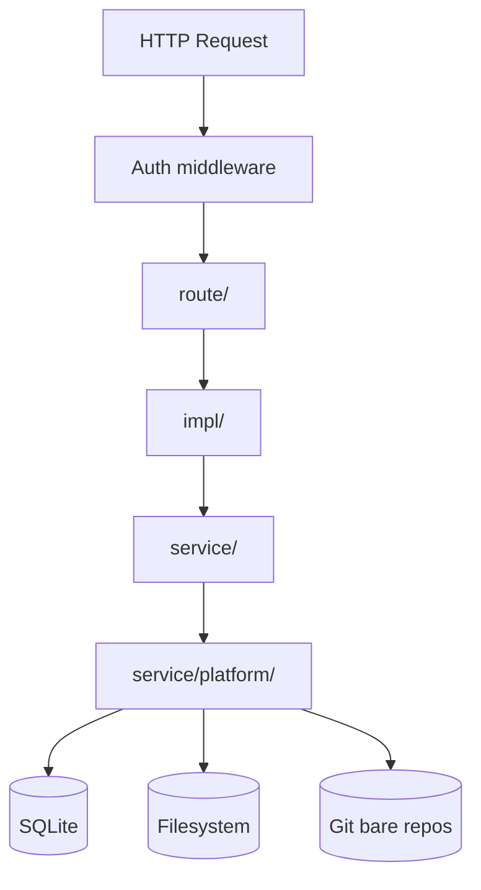

# System Architecture

Polygon-Replica is a self-hosted problem authoring system.

Current runtime model:
- Git bare repos are the source of truth for problem content.
- SQLite stores metadata only.
- Derived payload files live on the local filesystem.
- Preview compile is synchronous in the request path.
- Verification, run, export, and contest jobs are async worker-queue jobs.
- Judgehost-compatible API lives under `/api/v4/*`.
- Cache-backed filesystem state is startup-cleared by the current runtime policy.

## Layer Model

The codebase is still organized as a layered FastAPI application.



### route/

Route files register endpoints and delegate to `impl/` handlers.

| File | Scope |
|------|-------|
| `root_auth_route.py` | login, register, setup, home, problem list, contest list |
| `agent_route.py` | agent pairing UI and `/agent/v1/*` API |
| `problem_route.py` | problem workspace pages, git actions, settings |
| `contest_route.py` | contest pages, roster, access, packages |
| `judgehost_route.py` | `/api/v4/*` DOMjudge-compatible API |
| `preview_route.py` | statement preview pages and actions |
| `run_export_route.py` | run pages, run execute/cancel, export pages, artifact downloads |
| `tests_route.py` | test-spec editing and verification actions |

There is no `/runs/{run_id}/artifacts/...` route anymore. Fresh run and verification downloads go through `/problems/{problem:path}/artifacts/{verification_id}/...`.

### impl/

`impl/` orchestrates requests:
- builds page context
- enforces access control
- validates form input
- delegates to services through `config.*`
- renders Jinja templates or redirects

Important current artifact-related modules:
- `app/impl/workspace/artifact.py`: verification artifact resolver and virtual artifact paths
- `app/impl/run_export/artifact.py`: browser responses for verification artifacts and exports
- `app/impl/workspace/run_view_detail.py`: builds the run-detail page using verification task rows and artifact refs

### service/

`service/` contains domain logic.

Important domains:
- `repository`: bare repos, workspaces, snapshots
- `verification`: verification records, task rows, signatures, artifact refs
- `judgehost`: DOMjudge-compatible task dispatch and result collection
- `statement`: preview compile and sample sync
- `export`: export packaging and archive lookup
- `contest`: contest build/export workflows
- `disk`: SQL-backed stores

### service/platform/

`service/platform/` provides shared infrastructure:
- `worker_queue.py`: async worker queue with durable event log
- `runtime_blob_store.py`: immutable content-addressed runtime blobs
- `runtime_cache_index.py`: process-local result and executable cache metadata
- `fs/layout.py`: typed filesystem layout helpers
- `hashing.py`, `git_process.py`, `latex_process.py`, `workspace_path.py`, `system_config.py`

## RuntimeConfig

`app/impl/runtime/config.py` is still the central wiring object. It holds:
- service singletons
- DB handle
- Jinja templates
- filesystem manager
- concurrency state for preview, export, verification, and login rate limiting

This is current fact, not a target design.

## Storage Model

Three storage backends matter in day-to-day execution.

| Backend | Purpose | Current role |
|---------|---------|--------------|
| SQLite | metadata | users, problems, workspaces, verifications, verification_tasks, previews, exports, contests, audit log, runtime config |
| Git bare repos | source of truth | problem sources only |
| Filesystem | derived payloads | snapshots, preview PDFs, export archives, runtime blobs |

## Current Filesystem Layout

The exact root paths come from environment settings. Relative to those roots, the current layout is:

### Cache root

```text
<cache_root>/
  artifacts/
    verifications/<verification_id>/
      logs/
    previews/<preview_id>/
      logs/
      statement_preview/
  runtime/
    snapshots/<snapshot_id>/src/
    blobs/<hash-prefix>/<sha256>
    worker-queue-events.jsonl
```

What each area means:
- `artifacts/verifications/<id>/logs`: human-readable verification logs
- `artifacts/previews/<id>/statement_preview/statement.pdf`: preview output
- `runtime/snapshots/<id>/src`: snapshot created for verification/preview/export execution
- `runtime/blobs/<prefix>/<sha256>`: immutable payloads referenced as
  `blob://sha256/<sha256>` from SQLite and runtime cache metadata

Judgehost task/job/case scheduling state is process-local and indexed in memory.
It is not stored in SQLite: startup reconciliation fails durable inflight
`verification_tasks`, while fresh work creates new runtime records. Runtime
identities use a verification-scoped 60-second quiet window. Cache index entries
and immutable blobs have an independent startup-scoped lifetime.

### Artifacts root

`artifacts_root` is still used for durable export and contest files.

```text
<artifacts_root>/
  exports/
  contests/
```

## Verification Artifact Read Model

Verification pages and downloads now use ref-based lookup.

Current public download paths are under `/problems/{problem:path}/artifacts/{verification_id}/...`:
- `tests/{test_name}`
- `ans/{answer_name}`
- `output/{task_id}/{file_name}`
- `blob/{encoded-token}/{file_name}`

The resolver lives in `app/impl/workspace/artifact.py`.

Important current rules:
- `Input` downloads resolve `input_ref` from `verification_artifact_refs`.
- `Answer` downloads resolve `answer_ref` from `verification_artifact_refs`.
- `Output` downloads resolve `verification_tasks.output_ref` by `task_id`.
- There is no fresh-path dependency on `runs/<run_id>/...`.

## Startup Policy

At startup the runtime layer:
- cancels inflight preview, contest, judgehost, and verification rows
- clears `cache_root/artifacts`
- clears `cache_root/runtime`
- resets the process-local runtime cache index
- clears the worker-queue durable log
- starts the worker queue

This means cache-root data is operationally derived, not durable truth.
