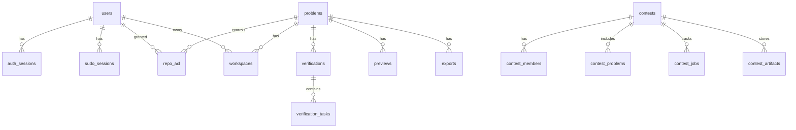

# Database Schema and Data Patterns

## Overview

Polygon-Replica uses SQLite with WAL journaling and incremental auto-vacuum. There is no ORM. Schema and in-place migrations live in `app/db.py`.

`DB` is a thin helper around raw SQL with:
- `fetch_one`
- `fetch_all`
- `execute`
- `write_transaction`

## Core Rule

The database stores metadata and structured task details. Large payloads stay on the filesystem.

Examples:
- stored in DB: verification status, task verdicts, timing, compile log, diagnostics JSON, `output_ref`
- stored on filesystem: snapshots, judgehost workdirs, preview PDFs, export archives, blob-cache payloads

## Main Entity Relationships

## Tables by Domain

### Auth

| Table | Purpose |
|-------|---------|
| `users` | user accounts |
| `auth_sessions` | session cookies |
| `sudo_sessions` | short-lived elevated sessions |

### Problems and Workspaces

| Table | Purpose |
|-------|---------|
| `problems` | problem metadata |
| `repo_acl` | problem-level access control |
| `workspaces` | per-user git checkout metadata |

Important `workspaces` columns:
- `path`
- `branch`
- `head_commit`
- `dirty`
- `recent_verification_status`
- `updated_at`

### Verification

#### `verifications`

Current columns:
- `id`
- `problem_id`
- `workspace_id`
- `signature`
- `kind`
- `status`
- `fail_reason`
- `created_at`
- `finished_at`

Important notes:
- `kind` is durable and meaningful: `all`, `sample`, or `custom`
- `signature` is the current durable identity for a verification row
- there is no `source_commit` or `source_ref` on `verifications`

#### `verification_tasks`

Current columns:
- `id`
- `verification_id`
- `predecessor_task_id`
- `task_kind`
- `source_path`
- `logical_run_id`
- `test_name`
- `expected_behavior`
- `final_status`
- `verdict`
- `runtime_sec`
- `cpu_sec`
- `wall_sec`
- `memory_kb`
- `compile_log`
- `diagnostics_json`
- `error_text`
- `feedback_text`
- `output_ref`
- `finished_at`
- `created_at`

What this table stores:
- DAG structure through `predecessor_task_id`
- per-task final state
- per-task timing and memory
- compile diagnostics and short text feedback
- `output_ref`, which is the current locator for task output bytes

What it does not store:
- raw output bytes
- input bytes
- answer bytes

### Preview and Export

#### `previews`

Current columns:
- `id`
- `problem_id`
- `workspace_id`
- `verification_id`
- `source_commit`
- `source_ref`
- `status`
- `summary_json`
- `created_at`
- `finished_at`

`summary_json` is the structured preview summary. The compiled PDF stays on the filesystem.

#### `exports`

Current columns:
- `id`
- `problem_id`
- `verification_id`
- `workspace_id`
- `export_type`
- `filename`
- `sha256`
- `size_bytes`
- `source_commit`
- `created_at`

The database records export metadata. The archive bytes stay on the filesystem.

### Contests

| Table | Purpose |
|-------|---------|
| `contests` | contest metadata |
| `contest_members` | contest ACL |
| `contest_problems` | contest roster |
| `contest_jobs` | async contest jobs |
| `contest_artifacts` | contest file metadata |
| `contest_properties` | contest config |
| `contest_attachments` | uploaded contest assets |

### System

| Table | Purpose |
|-------|---------|
| `audit_log` | audit trail |
| `system_config` | runtime-config overrides |

## Verification File-Backed Metadata

Verification also has one filesystem metadata file:
- `<cache_root>/artifacts/verifications/<verification_id>/metadata.json`

This file currently stores verification-level metadata that is not normalized into tables. The most important live field is:
- `artifact_refs`

`artifact_refs` is keyed by test name and currently holds values such as:
- `input_ref`
- `answer_ref`

These refs point into blob storage and are used by the run-detail page, preview sample sync, and artifact downloads.

## Current Pattern for Verification Results

A finished verification writes structured result data to two places:

### SQLite
- `verifications`: top-level row status
- `verification_tasks`: task rows and `output_ref`

### Filesystem/blob store
- `metadata.json`: per-test artifact refs
- `judge-fs-index`: blobs addressed by cache tokens referenced from `output_ref`, `input_ref`, and `answer_ref`

## Conventions

- Domain entities such as users, problems, and contests use `INTEGER AUTOINCREMENT` primary keys.
- Transient or async records such as verifications, previews, exports, and worker jobs use `TEXT` identifiers.
- Timestamps are stored as ISO 8601 text.
- JSON payloads are stored as `TEXT` and parsed in application code.
- SQL access is explicit. Domain stores in `app/service/disk/` are thin wrappers around raw queries.

## Migrations

Schema migration is in-place inside `app/db.py`.

Current examples:
- `previews`: remove old path-based fields and preserve `summary_json`
- `contest_artifacts`: remove old `artifact_path`
- `verification_tasks`: remove old bundle refs and keep direct structured fields

There is no external migration framework.
