# Database Schema and Data Patterns

## Overview

Polygon-Replica uses SQLite with WAL journaling and incremental auto-vacuum. There is no ORM. The canonical schema lives in `app/db.py`.

`DB` is a thin helper around raw SQL with:
- `fetch_one`
- `fetch_all`
- `execute`
- `write_transaction`

## Core Rule

The database stores metadata and structured task details. Large payloads stay on the filesystem.

Examples:
- stored in DB: verification status, task verdicts, timing, compile log, diagnostics JSON, `output_ref`, `input_ref`, and `answer_ref`
- stored on filesystem: snapshots, judgehost workdirs, preview PDFs, export archives, blob-cache payloads

## Main Entity Relationships

```mermaid
erDiagram
    users ||--o{ auth_sessions : has
    users ||--o{ sudo_sessions : has
    users ||--o{ repo_acl : granted
    users ||--o{ workspaces : owns
    users ||--o{ agent_registration_codes : issues
    users ||--o{ agent_sessions : owns
    agent_sessions ||--o{ agent_access_requests : requests
    agent_sessions ||--o{ agent_tokens : grants
    problems ||--o{ repo_acl : controls
    problems ||--o{ workspaces : has
    problems ||--o{ verifications : has
    problems ||--o{ previews : has
    problems ||--o{ problem_package_materializations : materializes
    problem_package_materializations ||--o{ exports : derives
    problems ||--o{ export_jobs : requests
    users ||--o{ export_jobs : starts
    exports ||--o{ export_jobs : completes
    verifications ||--o{ verification_tasks : contains
    verifications ||--o{ verification_selected_tests : records
    verifications ||--o{ verification_source_paths : records
    verifications ||--o{ verification_tests_meta : records
    verifications ||--o{ verification_artifact_refs : records
    contests ||--o{ contest_members : has
    contests ||--o{ contest_problems : includes
    contests ||--o{ contest_jobs : tracks
    contests ||--o{ contest_artifacts : stores
    contest_jobs ||--o{ contest_build_items : freezes
    contests ||--o{ contest_attachments : stores
```

## Tables by Domain

### Auth

| Table | Purpose |
|-------|---------|
| `users` | user accounts |
| `auth_sessions` | session cookies |
| `sudo_sessions` | short-lived elevated sessions |

### Agent Access

| Table | Purpose |
|-------|---------|
| `agent_registration_codes` | one-time pairing codes |
| `agent_sessions` | connected agent identities |
| `agent_access_requests` | user approval requests for problem access |
| `agent_tokens` | scoped agent access tokens |

### Problems and Workspaces

| Table | Purpose |
|-------|---------|
| `problems` | problem metadata |
| `repo_acl` | problem-level access control |
| `workspaces` | per-user git checkout metadata |

Important `workspaces` columns:
- `path`
- `branch`
- `head_commit`
- `dirty`
- `recent_verification_status`
- `updated_at`

### Verification

#### `verifications`

Current columns:
- `id`
- `problem_id`
- `workspace_id`
- `signature`
- `source_commit`
- `kind`
- `status`
- `fail_reason`
- `mode`
- `pass_limit`
- `run_config_json`
- `error`
- `failed_step`
- `failed_check`
- `failed_test`
- `sanity_status`
- `sanity_checked_count`
- `validation_status`
- `validated_count`
- `created_at`
- `finished_at`

Important notes:
- `kind` is durable and meaningful: `all`, `sample`, or `custom`
- `signature` is the current durable identity for a verification row
- `source_commit` identifies the committed source used by published-revision
  verification; ordinary workspace verification may leave it empty

#### `verification_tasks`

Current columns:
- `id`
- `verification_id`
- `predecessor_task_id`
- `task_kind`
- `source_path`
- `logical_run_id`
- `test_name`
- `expected_behavior`
- `final_status`
- `verdict`
- `runtime_sec`
- `cpu_sec`
- `wall_sec`
- `memory_kb`
- `answer_correct`
- `compile_log`
- `diagnostics_json`
- `error_text`
- `feedback_text`
- `output_ref`
- `finished_at`
- `created_at`

What this table stores:
- DAG structure through `predecessor_task_id`
- per-task final state
- per-task timing and memory
- compile diagnostics and short text feedback
- whether the produced answer matched the expected answer
- `output_ref`, which is the current locator for task output bytes

What it does not store:
- raw output bytes
- input bytes
- answer bytes

#### Verification detail tables

| Table | Purpose |
|-------|---------|
| `verification_selected_tests` | ordered test names selected for the verification |
| `verification_source_paths` | ordered source files involved in the verification |
| `verification_tests_meta` | test source metadata, sample flags, command text, and payload source |
| `verification_sanity_checks` | per-check sanity status and checked counts |
| `verification_sanity_check_messages` | messages emitted by sanity checks |
| `verification_artifact_refs` | per-test `input_ref` and `answer_ref` |

`verification_artifact_refs` stores refs into the blob store. It is the current source for run-detail input/answer downloads and preview sample sync.

### Preview and Export

#### `previews`

Current columns:
- `id`
- `problem_id`
- `workspace_id`
- `verification_id`
- `source_commit`
- `source_ref`
- `status`
- `summary_json`
- `created_at`
- `finished_at`

`summary_json` is the structured preview summary. The compiled PDF stays on the filesystem.

#### `exports`

Current columns:
- `id`
- `problem_id`
- `materialization_id`
- `export_type`
- `options_hash`
- `filename`
- `archive_rel_path`
- `sha256`
- `size_bytes`
- `source_commit`
- `created_at`

The database records derived export metadata. Each export is derived from one
Native materialization and never reads a workspace or verification artifact.

#### `problem_package_materializations`

One row records the complete Native artifact for a unique
`(problem_id, source_commit)`. It stores the Git revision number, source digest,
archive path/hash/size, verification provenance, and availability state.
`problem_package_builds` records the single materialization attempt for that
same published revision.

#### `export_jobs`

`export_jobs` is the sole user-visible lifecycle model for package generation.
Its status is one of `queued`, `running`, `succeeded`, or `failed`. A succeeded
job points to its Native materialization and directly to its `exports` row
through nullable `export_id`; deleting an export sets that link to `NULL`.
Agent status/download and the Export Activity UI query this table and never
reconstruct lifecycle state from audit records.

Successful products are shared by problem readers and deduplicated by Native
materialization, export type, and canonical options. Jobs and their products
remain available until the administrator runs artifact cleanup.

### Contests

| Table | Purpose |
|-------|---------|
| `contests` | contest metadata |
| `contest_members` | contest ACL |
| `contest_problems` | contest roster |
| `contest_jobs` | async contest jobs |
| `contest_artifacts` | contest file metadata |
| typed columns on `contests` | status, source generation, location, date, and statement language |
| `contest_build_items` | frozen roster labels and Native revision inputs |
| `contest_attachments` | uploaded contest assets |

### System

| Table | Purpose |
|-------|---------|
| `audit_log` | current audit epoch; cleanup preserves its start/result records and removes all earlier history |
| `system_config` | runtime-config overrides |

## Current Pattern for Verification Results

A finished verification writes structured result data to two places:

### SQLite
- `verifications`: top-level row status
- `verification_tasks`: task rows and `output_ref`
- `verification_artifact_refs`: per-test `input_ref` and `answer_ref`
- verification detail tables: selected tests, source paths, test metadata, and sanity-check results

### Filesystem/blob store
- `runtime/blobs/<prefix>/<sha256>`: immutable blobs addressed by
  `blob://sha256/<sha256>` refs in `output_ref`, `input_ref`, and `answer_ref`

## Conventions

- Domain entities such as users, problems, and contests use `INTEGER AUTOINCREMENT` primary keys.
- Transient or async records such as verifications, previews, exports, and worker jobs use `TEXT` identifiers.
- Timestamps are stored as ISO 8601 text.
- JSON payloads are stored as `TEXT` and parsed in application code.
- SQL access is explicit. Domain stores in `app/service/disk/` are thin wrappers around raw queries.

## Schema compatibility

`app/db.py` defines one canonical schema. Startup validates existing tables and
fails when their shape differs; this codebase does not carry compatibility or
backfill paths for removed data models.
