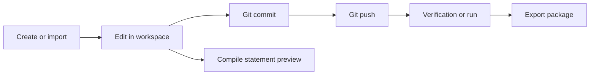
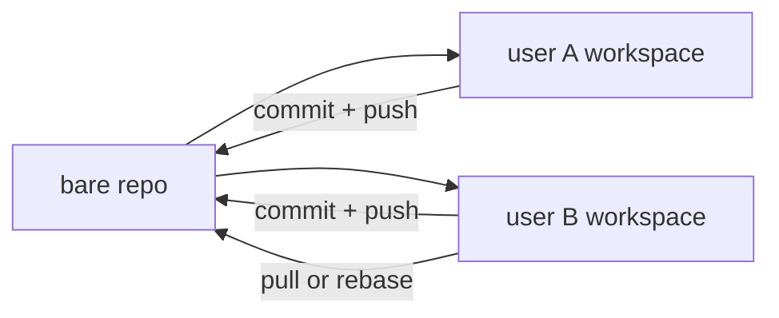

# Problem Editing and Workspace Model

## Problem Lifecycle



A problem is created from scratch or imported from an external package. Users edit sources in their own workspaces, commit and push to the bare repository, then run verification or export.

## Git-Backed Source of Truth

Every problem has one bare Git repository under `bare_root`.
That bare repo is the canonical source of truth for committed problem files.

Each user works in a separate workspace under `workspace_root`.
Multiple users can edit the same problem concurrently in separate checkouts.



`WorkspaceService` is responsible for:
- provisioning workspaces
- workspace status (`head_commit`, `dirty`)
- locking a workspace for mutation
- creating execution snapshots for verification, preview, and export

## Problem Repository Layout

Current source layout is Git-backed and lives inside the problem repository.

```text
config/
  problem.json
  build.json
checkers/
validators/
interactors/
generators/
solutions/
statement/
tests/
  spec.json
  manual/
  answers/
```

Important notes:
- `tests/spec.json` is the ordered test specification.
- `tests/manual/` stores authored manual input files.
- `tests/answers/` stores authored answer files when the problem uses committed answers.
- Generated tests are described in `tests/spec.json`; they are not committed as derived runtime outputs.

## Verification and Run Inputs

Verification and run do not operate directly on the mutable workspace tree.

Current execution model:
- the workspace is inspected for `head_commit` and `dirty`
- a snapshot is created when needed
- verification uses the snapshot plus test-spec runtime data
- execution results are recorded as task rows and artifact refs

Derived execution payloads are not written back to Git.

## Solutions and Expected Behavior

Current solution roles are determined from repository content and configuration.
Common categories are:
- main solution
- correct solutions
- expected failing solutions such as wrong-answer, runtime-error, or time-limit

Verification checks that each solution's observed result matches the expected behavior for that solution.

## Statement and Preview

Statement editing stays in the workspace. Preview compile is synchronous and writes derived files under cache-root preview artifacts.

Current preview inputs can also reuse verification artifact refs for sample sync:
- `input_ref`
- `answer_ref`

## Git Operations Exposed in the UI

The workspace pages expose:
- commit
- push
- pull
- restore revision
- rebase continue/abort

These all go through the repository services and Git helpers. They operate on the workspace and bare repo only; they do not touch derived verification artifacts.

## Access Control

Problem access is managed through `repo_acl` with three roles:
- `owner`
- `write`
- `read`

Permissions are granted at the problem level.

## Import Formats

Current import handlers normalize external packages into the same repository layout:
- Polygon packages
- ICPC packages
- native Polygon-Replica exports

Imports populate the bare repo, then users edit through their own workspaces.
