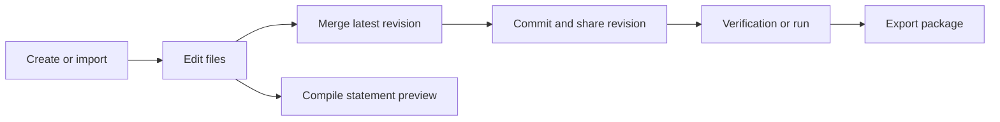
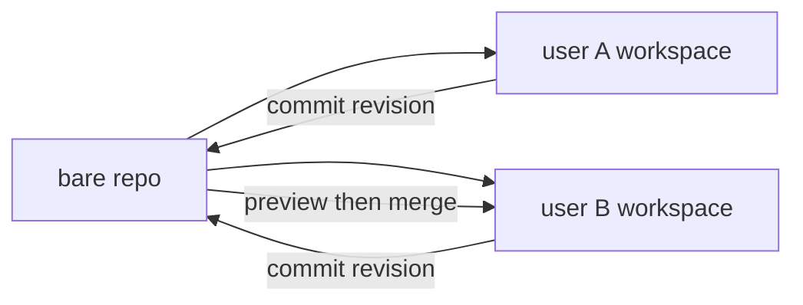

# Problem Editing and Workspace Model

## Problem Lifecycle



A problem is created from scratch or imported from an external package. Users edit sources in separate workspaces, merge the latest shared revision, commit the result, then run verification or export.

## Git-Backed Source of Truth

Every problem has one bare Git repository under `bare_root`.
That bare repo is the canonical source of truth for committed problem files.

Each user works in a separate workspace under `workspace_root`.
Multiple users can edit the same problem concurrently in separate checkouts.



`WorkspaceService` is responsible for:
- provisioning workspaces
- workspace status (`head_commit`, `dirty`)
- locking a workspace for mutation
- creating execution snapshots for verification, preview, and export

## Problem Repository Layout

Current source layout is Git-backed and lives inside the problem repository.

```text
config/
  problem.json
  build.json
checkers/
validators/
interactors/
generators/
solutions/
statement/
statement-sections/
  english/
    name.tex
    legend.tex
    input.tex
    output.tex
    interaction.tex
    notes.tex
tests/
  spec.json
  manual/
```

Important notes:
- `tests/spec.json` is the ordered test specification.
- `tests/manual/` stores authored manual input files.
- Official answers are generated by verification/export pipelines; they are not committed under `tests/`.
- `statement/` stores shared statement template assets.
- `statement-sections/<language>/` stores authored statement content for one language.
- Generated tests are described in `tests/spec.json`; they are not committed as derived runtime outputs.

## Verification and Run Inputs

Verification and run do not operate directly on the mutable workspace tree.

Current execution model:
- the workspace is inspected for `head_commit` and `dirty`
- a snapshot is created when needed
- verification uses the snapshot plus test-spec runtime data
- execution results are recorded as task rows and artifact refs

Derived execution payloads are not written back to Git.

## Solutions and Expected Behavior

Current solution roles are determined from repository content and configuration.
Common categories are:
- main solution
- correct solutions
- expected failing solutions such as wrong-answer, runtime-error, or time-limit

Verification checks that each solution's observed result matches the expected behavior for that solution.

## Statement and Preview

Statement editing stays in the workspace. Preview compile is synchronous and writes derived files under cache-root preview artifacts.

Current statement language model:
- the source of truth is the set of directories under `statement-sections/`
- there is no separate `language.txt`
- default language order is `english`, then `chinese`, then all other directories alphabetically

Current editing flow:
- opening the statement page without `?language=` picks the default language from directory order
- once the page resolves a language, save/compile actions keep carrying that explicit language
- adding a language creates `statement-sections/<language>/` and seeds:
  - `name.tex`
  - `legend.tex`
  - `input.tex`
  - `output.tex`
  - `interaction.tex`
  - `notes.tex`

Current preview behavior:
- preview compile runs for one language at a time
- preview cache identity includes the resolved language
- preview status is tracked per language
- derived preview files stay in preview artifacts; authored statement sources stay in Git-backed workspace files

Current preview inputs can also reuse verification artifact refs for sample sync:
- `input_ref`
- `answer_ref`

## Statement Export

Statement export walks every discovered language directory in the snapshot.

Current naming rules:
- `english` -> `problem.en.tex` and `problem.en.pdf`
- `chinese` -> `problem.zh.tex` and `problem.zh.pdf`
- every other language -> `problem.<language>.tex` and `problem.<language>.pdf`

The shared statement template is common across languages. The language-specific part is the content under `statement-sections/<language>/`.

### Exported Problem Identity

Problem identity and display metadata are separate values:

- `problem_slug` is the internal repository identity, such as `alice/two-sum`.
- `public_slug` is the exported identity, such as `two-sum`, and becomes the
  DOMjudge `externalid`.
- `problem_name` is the display title from
  `statement-sections/<default-language>/name.tex` in the exact Git revision
  being exported. It becomes both `problem.yaml.name` and the DOMjudge INI
  `name`.
- DOMjudge `short-name` is the contest label. Contest bundles pass their
  configured `A`, `B`, and so on; standalone exports use `public_slug`.

The default statement language order is `english`, then `chinese`, then the
remaining languages alphabetically. Dirty workspace content is never used to
derive export metadata. SQLite stores the problem slug and repository metadata,
not a global problem name.

## Revision Operations Exposed in the UI

The workspace pages expose Commit, Merge, revision history, and a one-level Undo for the most recent Merge.

Merge first creates a runtime-only preview. The preview captures the user's complete visible file tree and the latest shared revision without changing the workspace. A clean three-way result may be accepted as a suggestion; otherwise every affected file group requires an explicit whole-file choice. Applying a preview rechecks the workspace and shared revision, builds a complete candidate beside the workspace, and switches directories under a recoverable transaction journal.

The preview expires after 30 minutes or service restart. Undo is local, covers all visible files and executable bits, and remains safe only while the post-Merge workspace has not changed. A later successful Merge replaces the previous Undo snapshot. Commit is blocked when a newer shared revision exists, so users must Merge before publishing.

## Access Control

Problem access is managed through `repo_acl` with three roles:
- `owner`
- `write`
- `read`

Permissions are granted at the problem level.

## Import Formats

Current import handlers normalize external packages into the same repository layout:
- Polygon packages
- ICPC packages
- native Polygon-Replica exports

Imports populate the bare repo, then users edit through their own workspaces.
