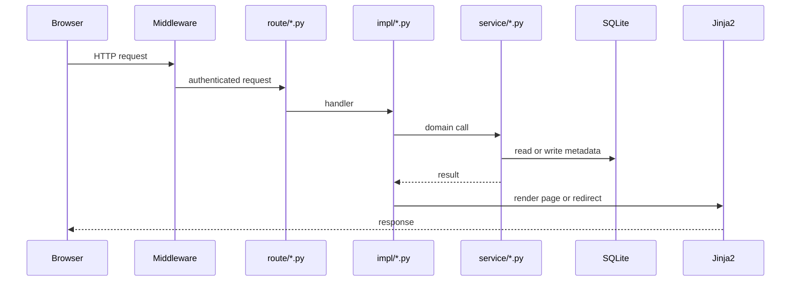
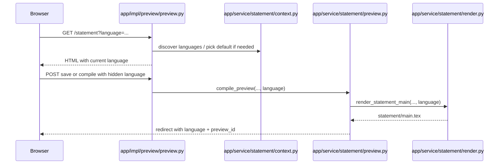

# Request Lifecycle and Auth

## Entry Point

`app/main.py` creates the FastAPI application, mounts static files at `/static`, and includes eight routers.

Current startup and shutdown hooks call:
- `app.impl.auth.internal.runtime.startup()`
- `app.impl.auth.internal.runtime.shutdown()`

Startup does more than auth wiring. It also:
- initializes metadata
- cancels inflight preview, contest, judgehost, and verification jobs
- clears cache-root state and the worker-queue durable log
- starts the worker queue

Shutdown stops the worker queue.

## HTTP Middleware

The top-level HTTP middleware:
1. records request start time
2. delegates to auth middleware
3. adds `X-Backend-Render-Ms` to the response

Auth middleware is responsible for:
- session validation
- attaching the current user to `request.state`
- CSRF/session enforcement for the web UI

## High-Level Request Flow

## Auth Model

### Web UI auth

The web UI uses session cookies stored in `auth_sessions`.

Current pieces:
- login session cookie
- sudo session cookie for destructive actions
- in-memory login rate limiting state on `RuntimeConfig`

### Judgehost auth

The judgehost API under `/api/v4/*` uses a separate auth path.
It does not use the browser session cookie.

Current judgehost auth accepts configured credentials for DOMjudge-compatible clients.
The credential pair is the only judgehost authentication identity: the configured
`JUDGEHOST_API_USERNAME` and `JUDGEHOST_API_TOKEN` are checked through Basic or
Bearer authentication. The service does not bind credentials to the request's
source IP, source port, reverse-proxy address, or any other peer value.

The `hostname` sent by a daemon is a logical scheduling label. It is retained for
host registration, lease ownership, affinity, callbacks, and telemetry, but it is
not an authentication principal and it is not required to authorize file access.

## Route Groups

### Root and auth
- `/login`, `/register`, `/setup`, `/sudo`, `/logout`
- `/`, `/problems`, `/contests`
- import entry points for problems and contests

### Problem workspace
- `/problems/{problem:path}/...`
- statement, generators, checker, validator, interactor, solutions, files, workspace, history, access
- git operations and settings pages

### Contest
- `/contests/{contest}/...`
- overview, problems, readiness, properties, access, and Statements & Builds
- readiness compares published Git revisions with complete Native materializations
- contest builds freeze roster labels, source generation, and exact Native materialization IDs; they never provision workspaces or run Export implicitly
- contest membership derives read/write problem access dynamically; direct problem ACLs remain independent

### Agent
- `/agent/sessions`, `/agent/connect`, approval, revoke, and disconnect pages
- `/agent/v1/*` registration, auth, workspace, verification, export, and commit APIs

### Preview
- statement preview pages and compile/recompile actions
- statement language add action under `/statement/languages/add`

### Run and export
- `/problems/{problem:path}/run`
- `/problems/{problem:path}/run/new`
- `/problems/{problem:path}/run/details`
- `/problems/{problem:path}/run/details/test-fragment`
- `/problems/{problem:path}/run/execute`
- `/problems/{problem:path}/run/rejudge`
- `/problems/{problem:path}/run/cancel`
- `/problems/{problem:path}/export`
- `/problems/{problem:path}/export/create`
- `/problems/{problem:path}/export/snapshot`
- `/problems/{problem:path}/export/import`
- `/problems/{problem:path}/export/import/slug-hint`
- `/problems/{problem:path}/artifacts/{verification_id}/{rel_path:path}`
- `/problems/{problem:path}/exports/{export_id}/{filename}`

There is no current `/runs/{run_id}/artifacts/...` route.

Rejudge is exposed as **Rejudge Without Cache** because it deletes matching case-result cache entries before scheduling the new verification.

### Tests
- test-spec editing and verification actions

### Judgehost API
- `/api/v4/config`
- `/api/v4/languages`
- `/api/v4/judgehosts`
- `/api/v4/judgehosts/fetch-work`
- `/api/v4/judgehosts/get_files/source/{item_id}`
- `/api/v4/judgehosts/get_files/source/{contest_id}/{item_id}`
- `/api/v4/judgehosts/get_files/{file_type}/{item_id}`
- `/api/v4/judgehosts/get_version_commands/{judgetask_id}`
- `/api/v4/judgehosts/check_versions/{judgetask_id}`
- `/api/v4/judgehosts/update-judging/{hostname}/{judgetask_id}`
- `/api/v4/judgehosts/add-judging-run/{hostname}/{judgetask_id}`
- `/api/v4/judgehosts/add-debug-info/{hostname}/{judgetask_id}`
- `/api/v4/judgehosts/internal-error`

The source download endpoints resolve the existing 9.0.0 and main route forms by
their protocol IDs. Testcase downloads resolve the active testcase by
`testcase_id`; executable downloads resolve the active script by `(file_type,
script_id)`. An authenticated request may come from a different connection,
reverse proxy, or NAT path without first registering that connection's peer.

## Sync vs Async Work

Current runtime model:
- preview compile is synchronous in the request path
- verification jobs are async worker-queue jobs
- run execution is async and uses the verification task graph internally
- export jobs are async worker-queue jobs
- contest build/package jobs are async worker-queue jobs

## Statement Language Resolution

Statement requests use a two-step rule:
1. at the route/impl boundary, resolve the current language
2. pass that concrete language through the statement workflow

Current resolution source:
- language directories under `statement-sections/*`

Current default ordering:
- `english`
- `chinese`
- all remaining language directories alphabetically

Current rules by layer:
- `preview_page()` may pick a default language when the request URL has no `language`
- `preview_run()`, `preview_save()`, attachment actions, and export calls carry an explicit `language`
- render and preview services consume explicit language tokens
- preview cache keys and preview summaries are partitioned by language

There is no current `statement/language.txt` request dependency.

## Statement Request Flow

## Verification/Run Detail Downloads

Current run-detail downloads all go through verification artifact routes.

Examples:
- `tests/{test_name}`
- `ans/{answer_name}`
- `output/{task_id}/{file_name}`
- `blob/{encoded-token}/{file_name}`

Resolution is handled in `app/impl/workspace/artifact.py` and served by `app/impl/run_export/artifact.py`.

## Templates and Static Files

Templates live in `app/template/` and are rendered through the `Jinja2Templates` instance on `RuntimeConfig`.

Static assets live in `app/static/` and are mounted at `/static`.
