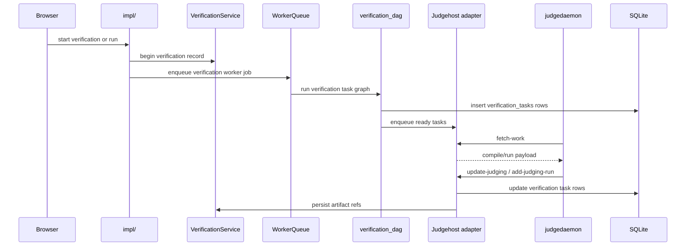

# Verification, Runs, and Judgehost Integration

## Two User-Facing Execution Modes

| Mode | Purpose | Current implementation |
|------|---------|------------------------|
| Verification | full problem check | creates a `verifications` row and a task graph in `verification_tasks` |
| Run | ad-hoc execution from the run page | uses the same verification/task-graph pipeline, typically with `kind=custom` |

Both modes delegate code execution to the judgehost adapter. The application itself does not run user code directly on the web process.

## Current Verification Flow

## Current Task Graph Model

A verification is represented by:
- one row in `verifications`
- many rows in `verification_tasks`

Important task kinds in the current graph:
- `generate-input`
- `main-correct`
- `solution-run`

Each task row records:
- `task_kind`
- `source_path`
- `logical_run_id`
- `test_name`
- `expected_behavior`
- final state and verdict
- timing and memory
- `compile_log`, `diagnostics_json`, `error_text`, `feedback_text`
- `output_ref`

`logical_run_id` is the column/grouping token used by the run-detail UI. It is not a blob signature.

## Verification Kinds

Current durable values are:
- `all`
- `sample`
- `custom`

Meaning:
- `all`: full test set
- `sample`: sample-only verification
- `custom`: user-selected subset from the run page

## Status Model

Top-level verification statuses currently used in the web UI are:
- `queued`
- `pending`
- `running`
- `ok`
- `failed`

There is no top-level durable `cancelled` status anymore. User cancellation is recorded as `failed` with `fail_reason = verification cancelled by user`.

## Artifact Model

Current verification results are ref-based.

### Stored in SQLite
- `verifications`
- `verification_tasks.output_ref`
- `verification_artifact_refs.input_ref`
- `verification_artifact_refs.answer_ref`

### Stored in the blob store
Blob payloads live under `runtime/blobs/<prefix>/<sha256>` and are addressed by
`blob://sha256/<sha256>` refs.

Current roles:
- testcase input/answer cache
- exact case-cache payloads
- verification artifact blobs created from `input_ref`, `answer_ref`, and non-cache `output_ref`

## Download and Preview Paths

Fresh run and verification detail pages use only `/problems/{problem:path}/artifacts/{verification_id}/...`.

Current paths:
- `tests/{test_name}` -> resolves `input_ref`
- `ans/{answer_name}` -> resolves `answer_ref`
- `output/{task_id}/{file_name}` -> resolves `verification_tasks.output_ref`
- `blob/{encoded-token}/{file_name}` -> resolves an explicit blob token

There is no fresh `/runs/{run_id}/artifacts/...` path anymore.

## Input, Answer, and Output Lifecycle

### `solution-run`
- stock judgedaemon executes the case in its own work directory
- retained output is published once as an immutable runtime blob and may be indexed
  by the exact case cache
- `verification_tasks.output_ref` stores the locator
- the detail page reads output through `output_ref`

### `generate-input`
- output bytes are resolved from the execution result
- verification stores an `input_ref` for the test in `verification_artifact_refs`
- the detail page and preview sample sync read input through `input_ref`

### `main-correct`
- main runs through compare/checker; it does not skip compare
- on success, verification stores an `answer_ref` in `verification_artifact_refs`
- the detail page and preview sample sync read answer through `answer_ref`

## Judgehost Integration

The judgehost adapter exposes the DOMjudge-compatible API at `/api/v4/*`.

Current important endpoints:
- `GET /api/v4/config`
- `GET /api/v4/languages`
- `GET /api/v4/judgehosts`
- `POST /api/v4/judgehosts`
- `POST /api/v4/judgehosts/fetch-work`
- `GET /api/v4/judgehosts/get_files/source/{item_id}`
- `GET /api/v4/judgehosts/get_files/source/{contest_id}/{item_id}`
- `GET /api/v4/judgehosts/get_files/{file_type}/{item_id}`
- `GET /api/v4/judgehosts/get_version_commands/{judgetask_id}`
- `PUT /api/v4/judgehosts/check_versions/{judgetask_id}`
- `PUT /api/v4/judgehosts/update-judging/{hostname}/{judgetask_id}`
- `POST /api/v4/judgehosts/add-judging-run/{hostname}/{judgetask_id}`
- `POST /api/v4/judgehosts/add-debug-info/{hostname}/{judgetask_id}`
- `POST /api/v4/judgehosts/internal-error`

Authentication is separate from session auth and uses judgehost credentials.
Those credentials are the complete service-side judgehost identity: Basic or
Bearer authentication is checked against `JUDGEHOST_API_USERNAME` and
`JUDGEHOST_API_TOKEN`. The service deliberately does not infer or bind a
judgehost identity from `request.client`, source IP/port, reverse-proxy headers,
or NAT address.

The hostname in registration, fetch, and callback payloads/paths remains a
logical scheduler label. It owns leases, selects host affinity, and keys
telemetry; it is not an authentication principal. The file endpoints do not
require a prior peer registration: testcase files resolve by the existing
`testcase_id` index, executable files by the existing `(kind, script_id)` index,
and source files by their existing 9.0.0 or main route ID.

## Judgehost Lifecycle

The runtime keeps four distinct lifecycle layers:

- `verification_tasks` rows are durable per-case product results. A case report updates its matching row immediately and only once.
- A judgehost task has an immutable case set. It becomes terminal only after all of its own cases are `reported` or `cancelled`.
- A DOMjudge case is leased independently. Registering/reconnecting a judgedaemon
  or explicitly disabling its host releases ordinary `leased` cases back to
  `pending`; result and cache I/O first claim the Case as `reporting` or
  `cache-probing`, then commit a terminal result.
- An internal `ExecutionBatch` is the scheduling and materialization container
  for one logical run inside one Verification. Its unique identity is
  `(verification_id, logical_run_id)`, and every appended task must have the
  same execution signature. It is not a DOMjudge protocol identity.

The existing DOMjudge fields have independent identities:

- `jobid` is the canonical Verification hex number reduced modulo `2^63`.
- `submitid` is the full compile-input SHA-256 reduced modulo `2^63`.
- `uuid` is that full compile-input SHA-256.
- `judgetaskid` is the internal Case ID.

Batch and Case IDs share one process-local sequence whose default base is
`time.time_ns()`. IDs must fit in a positive signed 64-bit integer. This assumes
one Scheduler process, a wall clock that does not move substantially backwards,
and entity creation far below one billion IDs per second.

Consequently, all Batches inside one Verification reuse one `jobid`, while
identical compile inputs reuse one `submitid` and `uuid`. The source endpoint
resolves the immutable compile submission by `submitid`. Active-runtime numeric
ID collisions fail enqueue instead of selecting a different protocol ID.

Cancellation moves idle cases directly to `cancelled`. An in-flight
`reporting/cache-probing` Case records a deferred cancellation, which takes effect
when the current claim commits or aborts. Late judgedaemon callbacks are
acknowledged without reviving the case.

The Coordinator closes a logical run only after all of its planned task results
are durable and their DAG transitions have been applied. The Batch may therefore
remain open while it temporarily has no ready Cases. Once the logical run is
closed and all of its Cases are terminal, the Scheduler atomically changes the
Batch from `open` to `finalize-pending`; later appends are rejected rather than
creating a rolling replacement. Exactly one finalizer can claim
`finalize-pending -> finalizing`, and failure returns the Batch to
`finalize-pending` for indexed retry. Verification cleanup closes any omitted
logical runs as an idempotent fallback.

Later judgehost polls service the finalization retry heap. Duplicate result
callbacks are idempotent after the first reporting claim. A transient publication
failure retains the Batch result state and blob refs for indexed retry.

Case publication, task result aggregation, and task-terminal notification finish
before the final `completed/failed` transition. The server does not create a Batch
work root; source, testcase, executable, and result files are descriptor-backed.
Executable scripts have a different lifetime: they remain runtime-scoped and are
cleared at service startup, not when an individual Batch or Verification finishes.

The verification DAG uses a preordered ready deque and processes every dependency
edge once. The judgehost Task Registry stores only identity, immutable request
fingerprints, result receipts, wait conditions, and terminal cleanup metadata; it
does not schedule work.

Execution scheduling uses an exact ordered ready-Batch index plus one cache-pending
heap and one runnable Case heap per Batch. A ready Batch has exactly one ordered
entry keyed by service priority, dispatch count, Verification scope, descending
pending count, and Batch ID. Fetch does not scan or sort all Tasks, Batches, or
Cases. One ordinary reentrant lock protects only in-memory dictionaries, counters,
sets, and indexes; cache, filesystem, SQLite, and Coordinator notifications are
never accessed while it is held. Executable callbacks use a lifecycle-maintained
script-ID index rather than scanning open Batches.

Cases enter a Batch as `staged`, atomically activate as `cache-pending`, and cannot be
leased until their exact result-cache probe misses. A full cache hit reaches
`reported` without opening testcase or source payload files. Executable bundles are
indexed lazily only after at least one miss. Multiple hosts may compile the same
unknown Batch concurrently. Any valid compiler failure fails the Batch immediately;
later success or result callbacks cannot revive it.

Every reported Case owns one immutable canonical `CaseResult`. Cache hits and cold
callbacks build the same object, including feedback and the verification test row.
The Scheduler decrements a per-Task remaining counter in constant time; only the
last Case sorts that Task's Cases once and writes its final summary. Case polling is
an indexed lookup and never reconstructs feedback from artifacts.

Runtime cache entries are synchronized per cache key and refer only to immutable
blob refs. Unrelated cache keys perform file I/O concurrently; the small global
mutex only maintains ref-counted key locks. Coordinator and fetch fallback cache
claims use the same 256-item boundary as result persistence; fetch still stops at
its monotonic-time budget and atomically aborts unprocessed claims.

Only two global service classes exist: foreground direct/compile-only work and
background verification work. Foreground work cooperatively preempts between fetch
batches; already leased Cases are never cancelled. Within an ExecutionBatch, ready
Cases are leased by numeric test ordinal.

Each host keeps a FIFO affinity queue of at most four Batches. Selection continues
an existing lease first, then foreground work, local ready affinity, a ready
`main-correct` or `generate-input` prerequisite for blocked affinity, and finally
the global ordered index. Foreground, prerequisite, and global selection increment
the Batch dispatch count; existing-lease and affinity reuse do not. Registration,
disable, Batch closure, and runtime reset remove host affinity.

There is no automatic Case lease timeout. `POST /judgehosts` is judgedaemon's
startup/reconnect and unfinished-work return operation; idle status checks use
`GET /judgehosts`. Registration atomically returns ordinary leased Cases to
`pending`, leaves active reporting claims in place with requeue-on-abort, and
returns distinct `jobid`/`submitid` workdirs to the daemon. A host that disappears
and never registers again still requires an operator to disable it before its
Cases can be reassigned.

Job and Case state is held in typed indexed memory records rather than a shared
in-memory SQLite connection. Terminal verification results are persisted through
the existing Coordinator batch path before successors are released.

After a verification's final detail and status are durable, one process-wide
deadline scheduler starts a 60-second quiet window. Late result, internal-error,
debug-info, or lease-return activity restarts that verification's window. At the
deadline only that verification's indexed terminal task/case identities are
removed; content-addressed cache entries remain independent. Unknown callbacks
after cleanup are acknowledged as idempotent no-ops. This cleanup never removes
the exact case cache or executable cache, so it does not reduce cache hit rate and
does not require a periodic full-store retention scan.

`run_id` identifies one immutable judgehost task. Repeating the same request is
idempotent; reusing the same `run_id` with a different payload is rejected.

## Cache Behavior

Current cache behavior for execution results:
- only exact case cache remains
- solve-output cache has been removed
- after a runtime task identity is registered, the Verification Coordinator probes
  cache-pending Cases in 32-Case slices
- `fetch-work` retains a 250ms cache-probe fallback for work outside an active
  Verification Coordinator or races with the proactive path
- same-key cache reads/materialization are serialized without blocking unrelated keys
- cache-hit results still update `verification_tasks` and artifact refs through the normal batched finalize path
- testcase input/answer descriptors use manifest identities; cache hits do not open
  or rewrite payload files
- executable entries use the same per-key runtime cache index and immutable blob
  store and do not have an independent global I/O lock

## Worker Queue

`WorkerQueueService` is the async execution backbone.

Current facts:
- verification, run, export, and contest jobs run through the worker queue
- preview compile does not; it stays synchronous in the request path
- worker queue writes a JSONL durable log under `cache_root/runtime/worker-queue-events.jsonl`
- startup clears that log and resets inflight jobs

## Current Filesystem Touch Points During Verification

A single verification can write to these places:
- `artifacts/verifications/<verification_id>/logs/`
- `runtime/snapshots/<snapshot_id>/src`
- `runtime/blobs/<prefix>/<sha256>`
- `runtime/worker-queue-events.jsonl`

By current runtime policy, cache-root data is startup-cleared. Runtime executable
cache entries and blobs are not cleared at verification completion.
