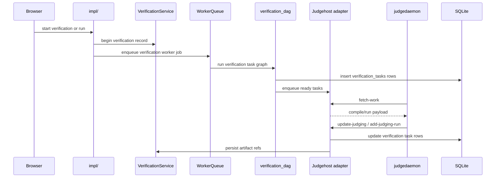

# Verification, Runs, and Judgehost Integration

## Two User-Facing Execution Modes

| Mode | Purpose | Current implementation |
|------|---------|------------------------|
| Verification | full problem check | creates a `verifications` row and a task graph in `verification_tasks` |
| Run | ad-hoc execution from the run page | uses the same verification/task-graph pipeline, typically with `kind=custom` |

Both modes delegate code execution to the judgehost adapter. The application itself does not run user code directly on the web process.

## Current Verification Flow

## Current Task Graph Model

A verification is represented by:
- one row in `verifications`
- many rows in `verification_tasks`

Important task kinds in the current graph:
- `generate-input`
- `main-correct`
- `solution-run`

Each task row records:
- `task_kind`
- `source_path`
- `logical_run_id`
- `test_name`
- `expected_behavior`
- final state and verdict
- timing and memory
- `compile_log`, `diagnostics_json`, `error_text`, `feedback_text`
- `output_ref`

`logical_run_id` is the column/grouping token used by the run-detail UI. It is not a blob signature.

## Verification Kinds

Current durable values are:
- `all`
- `sample`
- `custom`

Meaning:
- `all`: full test set
- `sample`: sample-only verification
- `custom`: user-selected subset from the run page

## Status Model

Top-level verification statuses currently used in the web UI are:
- `queued`
- `pending`
- `running`
- `ok`
- `failed`

There is no top-level durable `cancelled` status anymore. User cancellation is recorded as `failed` with `fail_reason = verification cancelled by user`.

## Artifact Model

Current verification results are ref-based.

### Stored in SQLite
- `verifications`
- `verification_tasks.output_ref`

### Stored in verification metadata
- `artifact_refs` in `<cache_root>/artifacts/verifications/<verification_id>/metadata.json`

Per-test refs currently include:
- `input_ref`
- `answer_ref`

### Stored in the blob store
Blob payloads live in `judge-fs-index` and are addressed by `cache://...` tokens.

Current roles:
- testcase input/answer cache
- exact case-cache payloads
- verification artifact blobs created from `input_ref`, `answer_ref`, and non-cache `output_ref`

## Download and Preview Paths

Fresh run and verification detail pages use only `/artifacts/{verification_id}/...`.

Current paths:
- `tests/{test_name}` -> resolves `input_ref`
- `ans/{answer_name}` -> resolves `answer_ref`
- `output/{task_id}/{file_name}` -> resolves `verification_tasks.output_ref`
- `blob/{encoded-token}/{file_name}` -> resolves an explicit blob token

There is no fresh `/runs/{run_id}/artifacts/...` path anymore.

## Input, Answer, and Output Lifecycle

### `solution-run`
- judgehost executes the case in `runtime/judgehost-runs/<judgehost_task_id>/...`
- the result becomes an exact case-cache blob when eligible
- `verification_tasks.output_ref` stores the locator
- the detail page reads output through `output_ref`

### `generate-input`
- output bytes are resolved from the execution result
- verification stores an `input_ref` for the test in `metadata.json`
- the detail page and preview sample sync read input through `input_ref`

### `main-correct`
- main runs through compare/checker; it does not skip compare
- on success, verification stores an `answer_ref` in `metadata.json`
- the detail page and preview sample sync read answer through `answer_ref`

## Judgehost Integration

The judgehost adapter exposes the DOMjudge-compatible API at `/api/v4/*`.

Current important endpoints:
- `GET /api/v4/config`
- `GET /api/v4/languages`
- `POST /api/v4/judgehosts/fetch-work`
- `PUT /api/v4/judgehosts/update-judging/{hostname}/{task_id}`
- `POST /api/v4/judgehosts/add-judging-run/{hostname}/{task_id}`
- `GET /api/v4/judgehosts/get_files/*`

Authentication is separate from session auth and uses judgehost credentials.

## Cache Behavior

Current cache behavior for execution results:
- only exact case cache remains
- solve-output cache has been removed
- cache lookup happens inside the judgehost adapter before work is sent to judgedaemon
- cache-hit results still update `verification_tasks` and artifact refs through the normal finalize path

## Worker Queue

`WorkerQueueService` is the async execution backbone.

Current facts:
- verification, run, export, and contest jobs run through the worker queue
- preview compile does not; it stays synchronous in the request path
- worker queue writes a JSONL durable log under `cache_root/runtime/worker-queue-events.jsonl`
- startup clears that log and resets inflight jobs

## Current Filesystem Touch Points During Verification

A single verification can write to these places:
- `artifacts/verifications/<verification_id>/metadata.json`
- `artifacts/verifications/<verification_id>/tests/`, `ans/`, `logs/`, `bin/`, `uploaded-sources/`
- `runtime/snapshots/<snapshot_id>/src`
- `runtime/judgehost-runs/<judgehost_task_id>/...`
- `judge-fs-index/v2/...`
- `async-task-cache/...`
- `runtime/worker-queue-events.jsonl`

By current runtime policy, cache-root data is startup-cleared.
